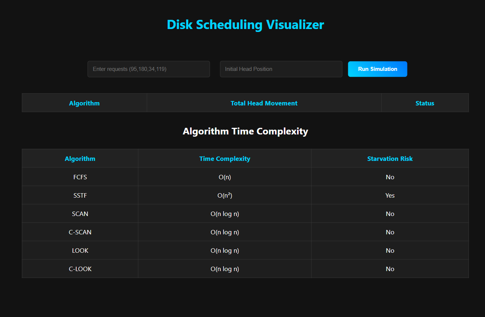

# 🚀 Disk Scheduling Visualizer

A Full-Stack Disk Scheduling Algorithm Simulator with interactive visualization, performance comparison, and animated disk head traversal.

---

## 🌟 Features

✔ FCFS, SSTF, SCAN, C-SCAN, LOOK, C-LOOK  
✔ Automatic Best Algorithm Detection  
✔ Dark Professional UI  
✔ Bar Chart Comparison (Chart.js)  
✔ Disk Head Movement Animation  
✔ Input Validation & Error Handling  
✔ Time Complexity & Starvation Comparison  

---

## 🛠 Tech Stack

**Frontend**
- HTML5
- CSS3 (Dark Theme UI)
- JavaScript
- Chart.js

**Backend**
- Node.js
- Express.js

---

## 📊 Algorithms Implemented

| Algorithm | Time Complexity | Starvation Risk |
|-----------|-----------------|----------------|
| FCFS      | O(n)            | No             |
| SSTF      | O(n²)           | Yes            |
| SCAN      | O(n log n)      | No             |
| C-SCAN    | O(n log n)      | No             |
| LOOK      | O(n log n)      | No             |
| C-LOOK    | O(n log n)      | No             |

---

## 📸 Preview

---
